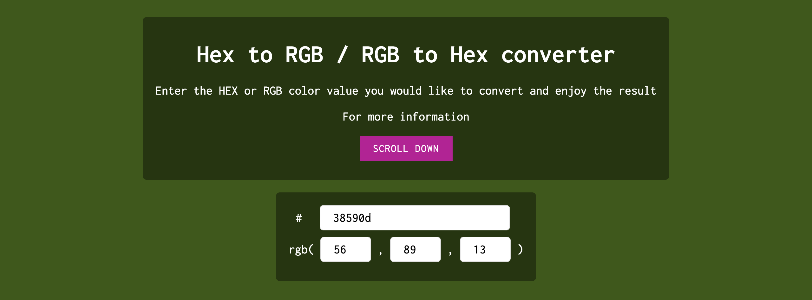

# Hex to RGB / RGB to Hex converter

This is the easy hex to rgb converter Tool.

Whether you're a designer, developer, or simply someone who loves playing with colors, our tool makes the conversion process a breeze. With real-time updates, all you need to do is enter the color value, and our website will instantly convert it to the corresponding Hex or RGB format. 

The dynamic background color feature provides visual feedback, allowing you to see the converted color in action. 

Are you curious about RGB and Hex color formats? RGB (Red, Green, Blue) is a color model that
                    represents colors by mixing different intensities of red, green, and blue light. Each component can
                    have values ranging from 0 to 255, resulting in over 16 million possible color combinations. 

On the
                    other hand, Hex (Hexadecimal) is a numerical representation of colors using a combination of six
                    alphanumeric characters. It is widely used in web design and development. Hex values consist of a
                    hashtag (#) followed by six characters, with each pair representing the intensity of red, green, and
                    blue using hexadecimal digits (0-9 and A-F). 

Our Hex to RGB / RGB to Hex converter website
                    effortlessly translates colors between these two formats, saving you time and allowing you to work
                    with colors more efficiently. Give it a try and unlock the world of color possibilities!

If you have an idea or feedback for our converter, we would love to hear it throught email <a
                        href="mailto:anniprysiazhniuk@gmail.com">anniprysiazhniuk@gmail.com</a>. Thank you.

